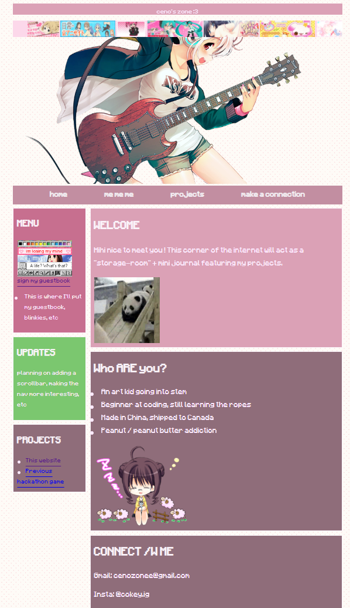

# moebeamahundredwebsite
An attempt at making a moe personal website to store personal projects and acts as a web portfolio

**try it**: https://ccceno.github.io/moebeamahundredwebsite/

features:
+ home page + guestbook page with a consistent layout
+ home page: easy navigation through the "welcome", "about me", and "socials" section

**important**: this site requires the user to enable javascript on browser

credits/acknowledgements:
+ css guide:
Sadgrl
https://codepen.io/sadness97/full/XJbLxNj
+ java guide:
Petrapixel
https://petrapixel.neocities.org/
+ aesthetics guide:
Chuchuns
https://www.youtube.com/watch?v=pfEy4BNeJdw
+ and our goat:
W3schools
